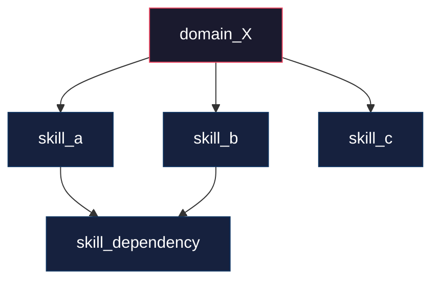
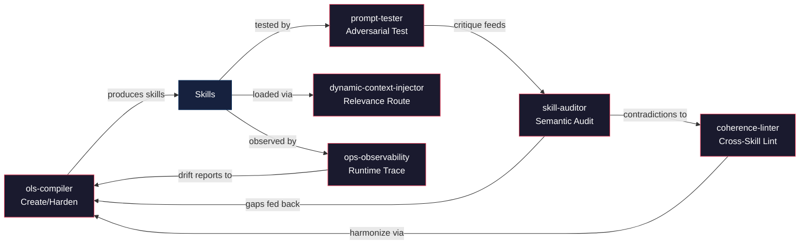
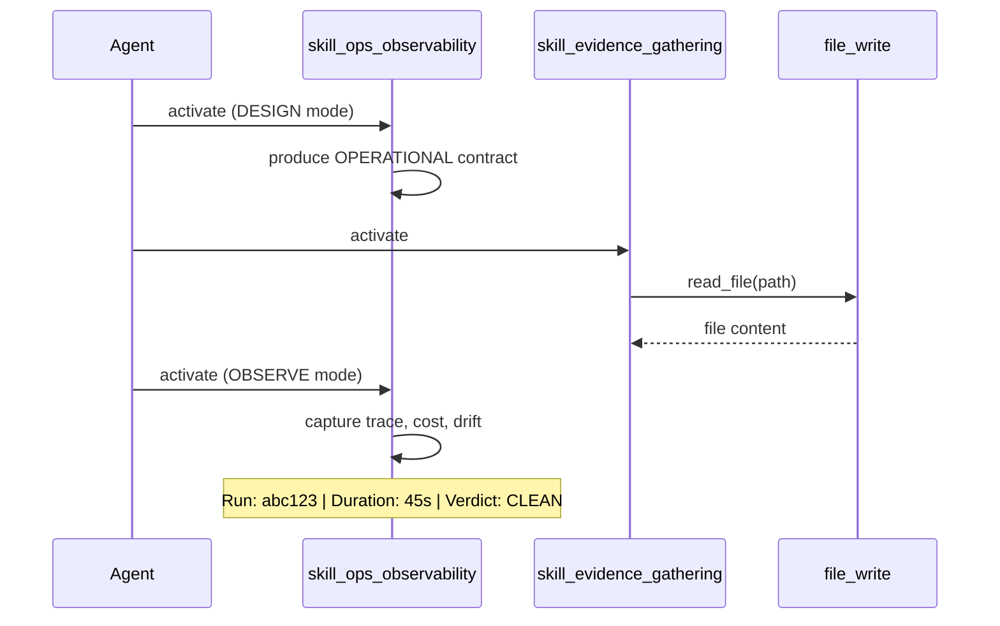
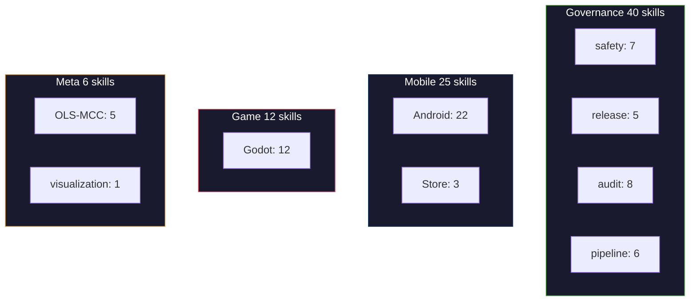

<!--
Babel — Prompt Operating System
Copyright © 2025–2026 Jonathan Gomez Aguilar
Licensed under the MIT License
Full license: https://github.com/gthgomez/Babel/blob/main/LICENSE

You are explicitly encouraged to use, modify, fork, and build commercial products on top of this prompt layer.
status: ACTIVE
last_verified: 2026-07-03
-->

# Skill: Visualization (v1.0)

**Category:** Meta Tools
**Status:** Active
**Layer:** `04_Meta_Tools/` — visual introspection for the Babel skill ecosystem
**Pairs with:** `ops-observability` (OBSERVE mode), `prompt_catalog.yaml`, `ols-compiler`, `coherence-linter`
**Activation:** Load when the user asks to "visualize", "diagram", "graph", or "map" the skill ecosystem — or when onboarding new contributors, auditing catalog structure, or analyzing runtime traces from OBSERVE mode.

---

## Purpose

As the Babel ecosystem grows past 100 skills, reasoning about how skills relate to each other becomes harder. Text-based catalog entries and handoff declarations are precise but not scannable. A visual graph — rendered natively in GitHub Markdown via Mermaid.js — makes structure immediately legible.

This skill generates four diagram types from Babel catalog and runtime data:

1. **Skill activation graph** — which skills load for a domain, with dependency edges.
2. **Meta-tool handoff graph** — the create → test → audit → lint → observe feedback loop.
3. **Workflow trace** — a sequence diagram from an OBSERVE mode run report.
4. **Catalog heatmap** — skill density by domain, tag overlap, and staleness.

All diagrams use Mermaid.js syntax (renders natively in GitHub Markdown, no external tools required).

---

## Mode Selection

| User Request | Diagram Type | Data Source |
|-------------|-------------|-------------|
| "Show me the skills for domain X" | Activation graph | `prompt_catalog.yaml` |
| "How do the meta-tools connect?" | Handoff graph | `04_Meta_Tools/` SKILL.md files |
| "Visualize this run" | Workflow trace | OBSERVE mode run report |
| "Show me catalog structure" | Heatmap / treemap | `prompt_catalog.yaml` |

---

## Diagram Types

### 1. Skill Activation Graph

Render a directed graph showing which skills load for a given domain, with dependency edges.

**Template:**


**Data:** Load `prompt_catalog.yaml`. For the target domain, extract `default_skill_ids` and each skill's `dependencies`. Render domain→skill edges and skill→dependency edges.

### 2. Meta-Tool Handoff Graph

Render the closed create → test → audit → lint → observe loop.

**Template:**


This graph is static — always the same 6 meta-tools + skills node.

### 3. Workflow Trace

Render a sequence diagram from an OBSERVE mode run report showing skill activations, tool calls, and drift events in temporal order.

**Template:**


**Data:** Parse an OBSERVE mode `RUN OBSERVATION` block. Extract activation order, tool calls, and verdict. Each activation becomes a `→` arrow; each tool call becomes a `→` request/response pair.

### 4. Catalog Heatmap

Render a structure diagram showing skill distribution across categories.

**Template:**


**Data:** Scan `prompt_catalog.yaml` skill entries. Group by path prefix (`02_Skills/Governance/`, `02_Skills/Mobile/`, `02_Skills/Game/`). Count per group. Render as subgraphs with counts.

---

## Output Structure

Every response follows this format:

```
[Diagram Title]
─────────────────
[1-2 sentence description of what this shows]

```mermaid
[diagram content]
```

Key:
- [legend entry if needed]
- [legend entry if needed]

Data: [source file(s) used, date]
```

---

## Boundaries — Do Not Overstep

- **This skill generates diagrams from existing data — it does not modify the catalog, skills, or runtime.** All data is read-only from `prompt_catalog.yaml`, SKILL.md files, and OBSERVE mode run reports.
- **Mermaid.js is the only supported format.** This skill does not generate Graphviz, D3, or PlantUML. GitHub-native rendering is the design constraint.
- **This skill does not create new data.** If the catalog doesn't have the data to render a requested graph, flag the gap — don't fabricate.
- **Workflow traces require an OBSERVE mode run report.** If no report is available, offer to run OBSERVE mode first.

---

## Failure Behavior of This Skill

- **Requested domain has no skills in catalog:** Render an empty graph with a note: "Domain X has no registered skills. Add entries to prompt_catalog.yaml first."
- **OBSERVE mode report is missing or malformed:** Flag as DATA_GAP. Suggest running `ops-observability` OBSERVE mode on a recent run to generate trace data.
- **Catalog is too large for a readable single graph:** Offer to split by domain or render aggregated counts instead of individual skill nodes.
- **Mermaid syntax error in rendered output:** Validate syntax against known-good templates in `references/mermaid-templates.md`. If a custom template fails, fall back to the closest standard template.

---

## Strategic Next Move

After every diagram, end with one next-move question: "Would you like me to render this for another domain?" or "Should I generate the workflow trace for this run?"

## References

- `references/mermaid-templates.md` — full template library with domain-specific examples, styling presets, and anti-patterns.
- `prompt_catalog.yaml` — canonical data source for skill activation graphs and catalog heatmaps.
- `ops-observability` (`02_Skills/Governance/Ops-Observability-v2.md`) OBSERVE mode — data source for workflow traces.
- `ols-compiler` (`04_Meta_Tools/OLS-MCC/ols-compiler/SKILL.md`) — for hardening diagram templates.

---

**Design note:** This skill implements Workstream A of the Beyond the OLS-MCC Roadmap. All diagrams use Mermaid.js (GitHub-native, zero dependencies). Value increases as the ecosystem grows past 100 skills and onboarding/auditing benefit from visual introspection.
