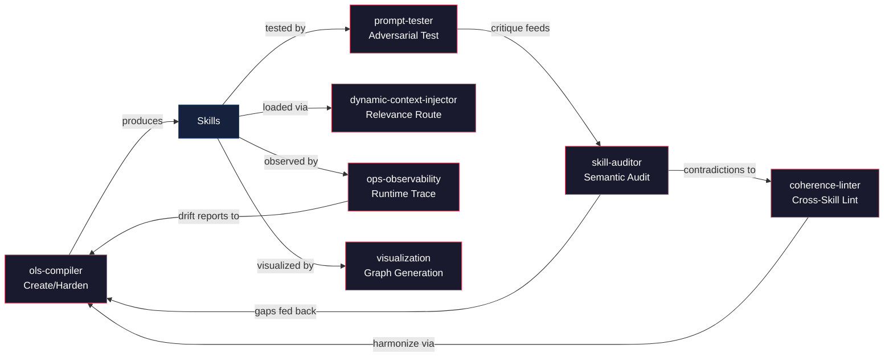
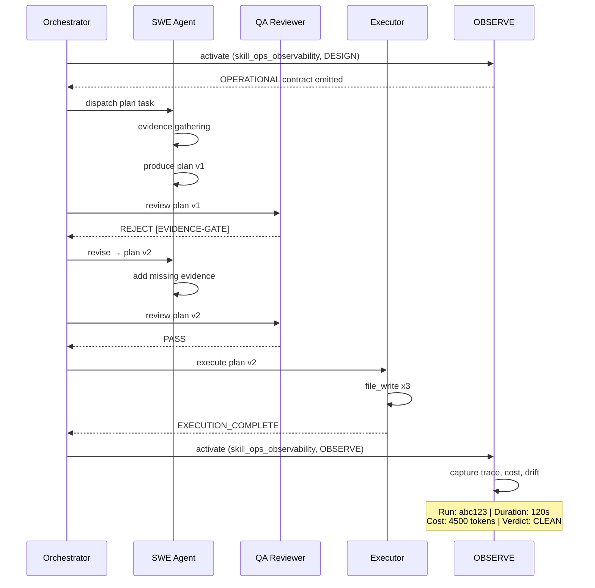
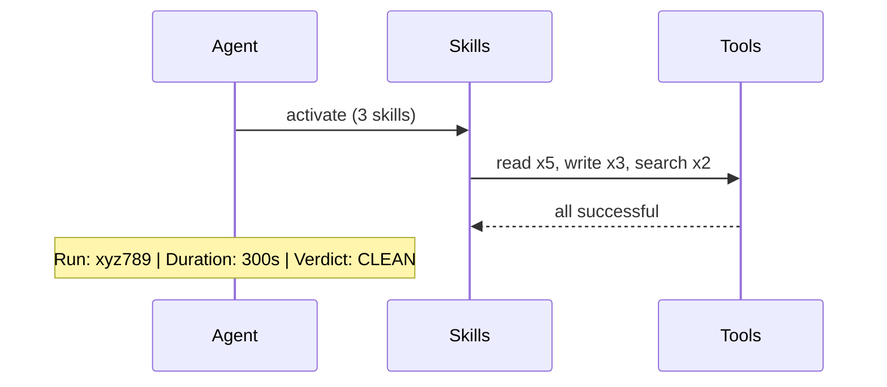
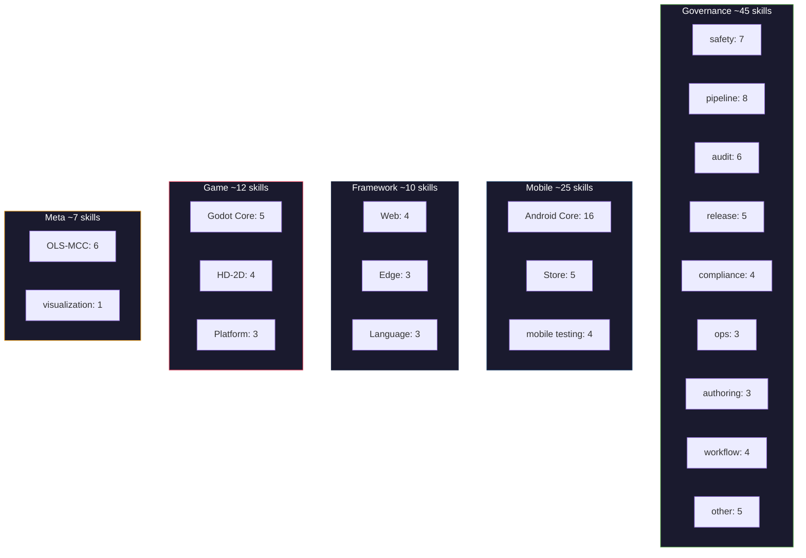
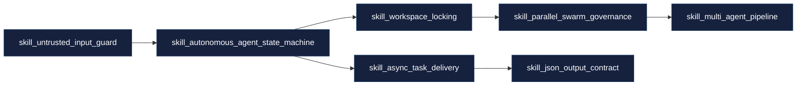

<!--
status: ACTIVE
last_verified: 2026-07-03
-->
# Mermaid Templates — Visualization Skill

**Purpose:** Full template library with domain-specific examples, styling presets, and anti-patterns. Load when the standard templates in SKILL.md need customization for a specific domain or data shape.

---

## 1. Styling Presets

Use these consistent color schemes across all diagrams:

| Context | Fill | Stroke | Use For |
|---------|------|--------|---------|
| Meta | `#1a1a2e` | `#e94560` | Meta-tools, OLS-MCC layer |
| Skill | `#16213e` | `#0f3460` | Regular skills |
| Domain | `#16213e` | `#4e9f3d` | Domain architects |
| Game | `#1a1a2e` | `#e94560` | Godot, game dev skills |
| Mobile | `#1a1a2e` | `#0f3460` | Android, mobile skills |
| Governance | `#1a1a2e` | `#4e9f3d` | Governance, safety skills |
| Overlay | `#1a1a2e` | `#f5a623` | Project/task overlays |
| Deprecated | `#333` | `#666` | Deprecated/superseded skills |

```mermaid
%% Usage:
classDef meta fill:#1a1a2e,stroke:#e94560,color:#fff
class myNode meta
```

---

## 2. Skill Activation Graph — Full Domain Example

### domain_android_kotlin (actual catalog data, June 2026)

```mermaid
graph TD
  android[domain_android_kotlin] --> bundle[skill_android_app_bundle]
  android --> release[skill_android_release_build]
  android --> play[skill_google_play_store]
  android --> comply[skill_android_play_store_compliance]
  android --> amazon[skill_amazon_appstore]
  android --> samsung[skill_samsung_galaxy_store]
  android --> rc[skill_revenuecat_iap]
  android --> billing[skill_google_play_billing]
  android --> compose[skill_jetpack_compose]
  android --> room[skill_android_room]
  android --> game[skill_android_game_development]
  android --> tv[skill_android_tv_game_ux]
  android --> guard[skill_untrusted_input_guard]
  android --> state[skill_autonomous_agent_state_machine]
  android --> async[skill_async_task_delivery]

  guard --> state
  state --> async

  classDef domain fill:#16213e,stroke:#0f3460,color:#fff
  classDef skill fill:#16213e,stroke:#0f3460,color:#fff
  class android domain
  class bundle,release,play,comply,amazon,samsung,rc,billing,compose,room,game,tv,guard,state,async skill
```



### domain_godot_game_dev (actual catalog data, June 2026)

```mermaid
graph TD
  godot[domain_godot_game_dev] --> arch[skill_godot_gdscript_arch]
  godot --> theme[skill_godot_ui_theme]
  godot --> data[skill_godot_data_resources]
  godot --> runtime[skill_godot_ui_runtime]
  godot --> test[skill_godot_testing_ci]
  godot --> export[skill_godot_android_export]
  godot --> input[skill_godot_input_save_audio]
  godot --> perf[skill_godot_performance_mobile]
  godot --> hd2d_render[skill_godot_hd2d_mobile_rendering]
  godot --> hd2d_map[skill_godot_hd2d_map_design]
  godot --> hd2d_ui[skill_godot_hd2d_rpg_ui]
  godot --> jrpg[skill_godot_mobile_jrpg_ux]

  classDef domain fill:#16213e,stroke:#e94560,color:#fff
  classDef skill fill:#16213e,stroke:#e94560,color:#fff
  class godot domain
  class arch,theme,data,runtime,test,export,input,perf,hd2d_render,hd2d_map,hd2d_ui,jrpg skill
```



---

## 3. Meta-Tool Handoff Graph (Static)



---

## 4. Workflow Trace Template

### From a real OBSERVE mode run (genericized)



### Anti-pattern to avoid

Don't render every tool call individually in a long trace — the diagram becomes unreadable past ~15 interactions. For long runs, group tool calls by category:



---

## 5. Catalog Heatmap Template

### Current ecosystem (June 2026, approximate)



---

## 6. Dependency Graph — Skill Chain Example

Render the full dependency chain for a specific skill to show all transitive deps:



---

## 7. Anti-Patterns

| Anti-Pattern | Problem | Fix |
|-------------|---------|-----|
| >20 nodes in a single graph | Unreadable wall of boxes | Split by domain or render aggregated counts |
| Mermaid `graph TD` for sequences | Wrong chart type — arrows don't show temporal order | Use `sequenceDiagram` for traces |
| Inline CSS via `style` attribute | Brittle, doesn't scale | Use `classDef` with consistent presets |
| Fabricating data for missing skills | Misleading diagram | Render empty graph with note, don't guess |
| Embedding raw Mermaid in prose without code fence | Won't render | Always wrap in ` ```mermaid ` fence |
