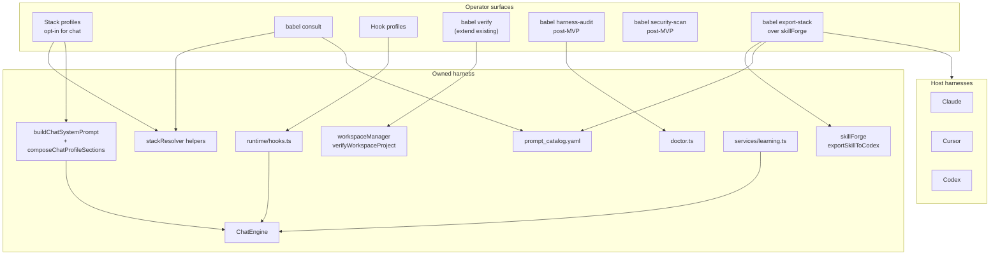
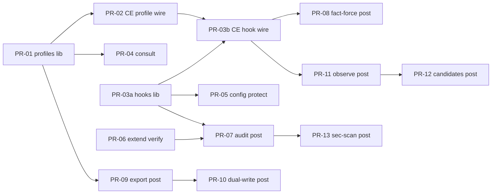

<!--
status: ACTIVE
last_verified: 2026-07-09
-->

# Babel Improvement Plan from ECC Competitive Teardown (2026-07-09)

| Field | Value |
|-------|-------|
| **Author** | Babel design (from `docs/research/ECC_VS_BABEL_DEEP_COMPARISON_2026-07-09.md`) |
| **Date** | 2026-07-09 |
| **Status** | ACTIVE — design review approved (rev3); implementation-ready |
| **Audience** | Senior engineers implementing sequenced PRs |
| **Primary research** | [ECC_VS_BABEL_DEEP_COMPARISON_2026-07-09.md](../research/ECC_VS_BABEL_DEEP_COMPARISON_2026-07-09.md) |
| **Repo path** | `docs/plans/BABEL_ECC_IMPROVEMENT_PLAN_2026-07-09.md` |
| **Revision** | 2026-07-09 rev3 — SessionStart/BABEL.md wire contract, single post-edit path, true conflict semantics, `babel codex export-skill` name fix |

---

## Overview

Babel is an **owned autonomous coding agent + Prompt OS**. ECC (Everything Claude Code) is a **cross-harness operator pack**. They do not compete on the same primary axis, but ECC productizes several operator surfaces that Babel either has only as internal machinery or lacks entirely: selective stack profiles, consult-before-load, hook profile knobs, verification rituals as first-class CLI, harness scorecards, portable skill envelopes, continuous-learning UX, and config-surface security scans.

This plan turns the 2026-07-09 teardown into a **sequenced implementation program**. The target shape is:

```
[ Owned harness (keep) ]
     +
[ ECC-grade operator packaging (steal) ]
     +
[ Portable skill export to host harnesses (new wedge) ]
     +
[ Hybrid learning: instinct UX × proof gates (unique) ]
```

This is **not** a market-parity chase and **not** a plugin-only pivot. Babel keeps ChatEngine, the deep pipeline, behavior≠knowledge, catalog SoT, sandbox, claims matrix, and proof-gated learning. We **productize and extend existing mechanisms first** (`babel verify` / `workspaceManager`, `skillForge.exportSkillToCodex`, `runtime/hooks.ts`, `learning.ts`); invent parallel systems only where the adaptation surface cannot carry the feature.

**MVP (weeks 1–4):** Track A core only — stack profiles (library + opt-in chat wire), consult, hook registry + ChatEngine wire + P0 #4/#5, extend existing `babel verify`. Post-MVP: harness-audit, export stack orchestrator, learning hybrid, security-scan, fact-force.

---

## Glossary (naming — do not overload)

| Term | Meaning | Not to confuse with |
|------|---------|---------------------|
| **Stack profile** | Named chat/export composition of catalog IDs: `minimal\|core\|developer\|security`. Env: `BABEL_STACK_PROFILE`. Flag: `--stack-profile`. | — |
| **Hook profile** | Named set of enabled runtime hooks: `minimal\|standard\|strict`. Env: `BABEL_HOOK_PROFILE`. | — |
| **Execution profile** | Sandbox/tool allowlist lane (`BABEL_EXECUTION_PROFILE`, e.g. `workspace_manager`, `benchmark_container`). Flag: `--execution-profile`. | Independent of stack/hook profiles |
| **task_shape_profile** | Internal resolution-policy field in stackResolver / manifests (`full`, etc.). | **Never** reuse as CLI stack profile |
| **Approval profile** | Lite/approvals UX (`auto-edit`, etc.) | Unrelated |

---

## Background & Motivation

### Current state (verified 2026-07-09, rev2-corrected)

| Surface | State | Evidence |
|---------|-------|----------|
| Chat loop | Strong owned harness | `babel-cli/src/agent/chatEngine.ts` (~3601 LOC); stall/gate/tools/evidence |
| Chat system prompt | **Hard-coded operational** — no catalog layer load | `buildChatSystemPrompt` in `agent/chatToolDefinitions.ts`; `getOrBuildSystemPrompt` appends systemContext / preflight / repo map / verifier hint only |
| Stack resolve | Budget-aware, catalog-driven (deep / resolve path) | `control-plane/stackResolver.ts` (`budgetAwareManifestPrune`, `previewInstructionStackResolution`); `assertNoConflicts` is **private** today — must export or reimplement for profiles |
| Runtime hooks | Present, under-productized; **ChatEngine unwired** | `runtime/hooks.ts`: SessionStart (no-op placeholder), PreToolUse (**shell_exec/test_run only**), PostToolUse, BeforeComplete, SessionEnd (single allow trace). Used from pipeline/executor paths, **not** ChatEngine |
| Plugin hooks | Trust-gated schema | `services/plugins.ts` events include PreToolUse, PostToolUse, PreWrite, … |
| Learning | Proof-first pipeline | `services/learning.ts`: failure → lesson → shadow → mutation package |
| Doctor | Broad runtime/workspace | `doctor.ts` scopes: all/env/workspace/repos/export/enterprise |
| Catalog | SoT for prompt IDs | `prompt_catalog.yaml` (189 `- id:` entries, tags + token_budget) |
| Consult / stack profiles | **Missing product surface** | Catalog exists; no consumer profiles (`task_shape_profile` is unrelated) |
| `babel verify` | **Partial — command exists; multi-phase ritual/artifacts incomplete** | `registerProjectCommands` → `babel verify` → `verifyWorkspaceProject` in `services/workspaceManager.ts` (approved roots, `analyzeProjectRoot` / `defaultVerifyCommands` test+build+lint, `SafeExecutor.testRun`, JSON/human, fail exit). No `--phases`, no `runs/verify/` artifact, no autoVerifierDiscovery merge |
| harness-audit / security-scan | **Missing** | Doctor / plugins doctor / mcpDoctor pieces only |
| Portable skill export | **Partial** | `skillForge.exportSkillToCodex` + CLI `babel codex export-skill` (under `registerSkillCommands` / `codex` parent) — single-skill Codex dir copy + validation. No stack-level multi-host bundle (`AGENTS.md` + multi-skill + rules) |

### Pain points

1. **Operators drown in full catalog context** — no `minimal|core|developer|security` chat profiles; chat does not load catalog at all today.
2. **Hooks are machinery, not product** — no profile knobs; write tools bypass PreToolUse; ChatEngine never calls hooks.
3. **Learning is proof-strong but UX-weak** — no session-end observation → instinct-like candidate loop.
4. **Users who will not switch CLIs get thin portability** — single-skill Codex export exists; stack-level host packs do not.
5. **No single readiness scorecard** — doctor fragments ≠ harness-audit rubric.
6. **Config-surface security is partial** — sandbox protects execution; AgentShield-class MCP/plugin/settings scan is missing.
7. **Verify is real but not ECC-style ritual** — command exists; lacks phased artifacts and discovery merge.

### Strategic non-move

Do **not** vendor ECC into this repository. Research clone lives at `/workspace-root/research/ECC` (MIT upstream). Steal **patterns**, not files, unless a separate licensing/scrub decision is made.

---

## Goals & Non-Goals

### Goals

1. **Productize operator packaging** for the owned harness (Track A MVP).
2. **Ship portable Prompt OS export** by generalizing `skillForge` / `exportSkillToCodex` (Track B, post-MVP primary).
3. **Hybrid learning UX** on top of existing proof gates (Track C, post-MVP).
4. **Safety defaults and config scanning** as first-class product (Track D: config protection in MVP hooks; fact-force + security-scan post-MVP).
5. **Preserve all Babel invariants** (V9, behavior≠knowledge, catalog SoT, co-evolution, claims honesty).
6. Deliver as **independently mergeable PRs** with **hard single-owner** rule for `chatEngine.ts`.

### Non-goals (near term — from research §8 + deliberate de-scopes)

| Non-goal | Rationale |
|----------|-----------|
| Clone ECC’s 278-skill firehose into default chat context | Context bloat toxic; budgets + profiles first |
| Abandon owned CLI for plugin-only distribution | Concedes control point Babel’s architecture assumes |
| Marketing parity with Claude Code / Codex without benchmarks | Claims matrix forbids; `claim_ready` stays false for parity |
| Ship `ecc2`-style second control plane | Daemon + TUI already cover multi-session needs |
| Vendor ECC sources into the private vault | Licensing/scrub required first; patterns only |
| Multi-language rule packs (22) / business-media skill packs | P2 later; not core coding-agent wedge |
| Dashboard GUI | TUI is primary surface |
| GitHub App skill generation | Growth loop, not harness quality |
| Mutating live subagent teams | Explicitly excluded by claims matrix |
| **Invent a second `babel verify` command** | Extend `projectCommands` + `workspaceManager.verifyWorkspaceProject` only |
| **Default-on catalog injection for all chat users** | Opt-in until dogfood; legacy prompt remains default |
| **Research P1 #13 `ecc status`-style operator handoff artifact** | **Deferred** post-MVP (merge handoff + doctor + work items into one markdown status). Statusline ctx%/cost polish also later |
| Full deep-stack compile inside chat | Chat profiles inject **bounded, layer-labeled excerpts**, not V9 full resolve+compile |

---

## Double-Down: What Babel Must NOT Dilute

These strengths are load-bearing. Every PR in this plan must leave them stronger or unchanged — never thinner.

| # | Strength | Primary evidence | Dilution risk if we “just copy ECC” |
|---|----------|------------------|-------------------------------------|
| 1 | **Owned ChatEngine + TUI** | `agent/chatEngine.ts`, `ui/*` | Becoming a skill pack with no loop |
| 2 | **Deep governed pipeline** | `pipeline.ts` + stages, OLS-v9 contracts | Text-only multi-agent without typed QA |
| 3 | **Behavior ≠ knowledge** | `ARCHITECTURE.md`, Behavioral OS vs Domain Architects | Blurring rules into skills; chat inject must **label layers** |
| 4 | **Catalog as SoT + co-evolution** | `prompt_catalog.yaml`, `agentContracts.ts` | Free-floating SKILL.md without catalog IDs |
| 5 | **Token budget diagnostics at resolve** | `stackResolver.ts` | Char caps only, no layer math |
| 6 | **Proof-first learning** | `services/learning.ts` failure taxonomy + shadow | Freeform instincts auto-mutating prompts |
| 7 | **Sandbox + circuit breaker** | `sandbox.ts`, execution profiles | Approval-prompt culture without fail-closed |
| 8 | **Claims matrix honesty** | `docs/status/claims-matrix.md` | “Deployment-ready plugin” narrative |
| 9 | **Plugin trust levels** | `services/plugins.ts` | Untrusted hooks with full tool surface |
| 10 | **OLS-MCC meta quality loop** | `04_Meta_Tools/OLS-MCC/*` | CI-only validation without adversarial craft |

**Invariant reminder (high-risk zones):** `OLS-v9-Orchestrator.md`, `01_Behavioral_OS/*`, `prompt_catalog.yaml`, `schemas/agentContracts.ts`, `pipeline.ts` `build*Task`, `RULES_CORE.md` / `RULES_GUARD.md`. Runtime contract changes require prompt co-evolution in the **same change set**.

---

## Gap Matrix (severity + success metrics)

| Capability | Babel today | Severity | Target success metric |
|------------|-------------|----------|----------------------|
| Stack profiles for chat | Missing | **P0 High (MVP)** | Pure resolver returns deterministic ID sets for fixed fixtures; opt-in chat inject honors profile; estimated tokens ≤ cap |
| Consult before load | Missing | **P0 High (MVP)** | `babel consult "<need>"` ranked stack + token estimate; unit tests on tag matching |
| Hook profiles + knobs + CE wire | Internal only; CE unwired | **P0 High (MVP)** | Profiles + disable list; PreToolUse covers mutation tools; ChatEngine calls hooks; traces in evidence |
| Post-edit quality gates (research P0 #4) | Chat has post-edit static check in-engine; not hook-productized | **P0 High (MVP)** | Named hook or CE-aligned path emits circuit-breaker-friendly failures + evidence |
| SessionStart capped memory (research P0 #5) | BABEL.md via CE `systemContext`; repo map ad-hoc; SessionStart no-op | **P0 High (MVP)** | Bounded SessionStart inject for **non-CE** sources only; BABEL.md appears **once** in final system prompt; `injectedContext` wire contract + cache clear |
| `babel verify` phases/artifacts | **Partial** (command exists) | **P0 High (MVP)** | Extend existing command: optional `--phases`, `runs/verify/` artifact, discovery merge; no second verb |
| `babel harness-audit` | Missing | **P1 post-MVP** | Weighted scorecard; golden fixture score bands |
| Portable stack export | Partial (single-skill Codex) | **P1 post-MVP** | Stack orchestrator over skillForge; multi-host notes |
| Dual-write skill authoring | Catalog + forge validate | **P1 post-MVP** | Portable frontmatter YELLOW lint |
| Continuous learning UX | Proof learn exists | **P1 post-MVP** | Observations → candidates w/ confidence |
| Project-scoped lessons | Scope field exists | **P1 post-MVP** | Git remote hash isolation |
| Shadow before overlay mutation | Exists | **P1 Keep** | Zero path mutates without shadow |
| Config protection defaults | Partial | **P0/P1 MVP hooks** | Strict profile blocks protected-path writes without structured approval |
| Fact-force mode | Partial | **P1 post-MVP** | First write requires prior read/search when enabled |
| `babel security-scan` | Partial | **P1 post-MVP** | MCP/plugins/settings findings |
| Research P1 #13 operator status artifact | Missing | **Deferred** | Explicitly out of MVP |
| Specialist agent swarm / worktree OS | Partial | **P2** | Later |
| Skill breadth firehose | Narrower | **Low** | Non-goal |
| Public GTM install | Private lab | **GTM** | Not technical exit |

---

## Proposed Design

### Architecture target



### Design principle: productize before invent

| Need | Prefer existing | Only invent if… |
|------|-----------------|-----------------|
| Stack profiles | Catalog tags + exported conflict/budget helpers | Small `config/stack-profiles.json` |
| Consult | Catalog `tags` + token_budget | Ranking weights beyond tags |
| Hook profiles | `runtime/hooks.ts` | Named registry module |
| Verify | **`verifyWorkspaceProject` + projectCommands** + optional `discoverVerifierCommands` | Phased report types only — **no second CLI verb** |
| Harness audit | doctor checks | Scorecard aggregator (post-MVP) |
| Learning hybrid | `learning.ts` + SessionEnd | observations.jsonl store (post-MVP) |
| Security scan | plugins doctor + mcpDoctor | Static rule pack (post-MVP) |
| Export | **`exportSkillToCodex` / skillForge / skillCommands** | Stack orchestrator + host README templates |

---

## Track A — Harness Productization (P0 MVP)

### A1. Stack profiles for chat

**Problem.** Chat uses hard-coded `buildChatSystemPrompt` and never loads catalog layers. Operators cannot opt into bounded Behavioral OS / skill excerpts without full deep mode.

**Profile config** — `config/stack-profiles.json`:

```json
{
  "schema_version": 1,
  "profiles": {
    "legacy": {
      "description": "No catalog injection — preserve today's buildChatSystemPrompt only",
      "catalog_ids": [],
      "token_budget_cap": 0,
      "hook_profile_default": "standard"
    },
    "minimal": {
      "description": "Behavioral core excerpt only; lowest catalog tax",
      "catalog_ids": ["behavioral_core_v11"],
      "token_budget_cap": 800,
      "hook_profile_default": "minimal"
    },
    "core": {
      "description": "Behavioral + optional known project overlay excerpt",
      "catalog_ids": ["behavioral_core_v11"],
      "include_project_overlay_if_known": true,
      "token_budget_cap": 1500,
      "hook_profile_default": "standard"
    },
    "developer": {
      "description": "Core + fixed skill allowlist + optional domain defaults when domainId provided",
      "catalog_ids": ["behavioral_core_v11"],
      "fixed_skill_ids": ["skill_ts_zod"],
      "expand_domain_defaults": true,
      "tag_allowlist": ["utility:swe", "language:typescript", "utility:validation"],
      "tag_select_top_n": 3,
      "token_budget_cap": 3500,
      "hook_profile_default": "standard"
    },
    "security": {
      "description": "Core + governance/safety-tagged skills (budget-ranked)",
      "catalog_ids": ["behavioral_core_v11"],
      "tag_allowlist": ["governance:safety", "security", "utility:swe"],
      "tag_select_top_n": 4,
      "token_budget_cap": 3000,
      "hook_profile_default": "strict"
    }
  }
}
```

**Default (K13):** Unset `BABEL_STACK_PROFILE` / no `--stack-profile` ⇒ **`legacy`** (today’s prompt). No silent behavior/cost change for existing users. Dogfood `core` before any default flip (post-MVP, explicit release note).

#### A1.1 Chat composition algorithm (normative)

Today chat does **not** load catalog. New pure module:

`babel-cli/src/control-plane/stackProfiles.ts`  
`babel-cli/src/control-plane/composeChatProfileSections.ts` (or same file)

```ts
export type StackProfileName = 'legacy' | 'minimal' | 'core' | 'developer' | 'security';

export interface ComposeChatProfileInput {
  profile: StackProfileName;
  babelRoot: string;
  projectRoot?: string;
  /** Optional — without this, expand_domain_defaults is a no-op */
  domainId?: string | null;
  /** Optional — used only for tag scoring / consult-aligned ranking, not V9 purpose analysis */
  taskText?: string;
  /** Override catalog path in tests */
  catalogPath?: string;
}

export interface ChatProfileSection {
  catalogId: string;
  layer: string; // behavioral_os | domain_architect | skill | project_overlay | …
  heading: string; // e.g. "## Catalog layer: behavioral_os (behavioral_core_v11)"
  body: string;    // truncated excerpt
  declaredTokenBudget: number;
  actualEstTokens: number;
}

export interface ComposeChatProfileResult {
  profile: StackProfileName;
  catalogIds: string[]; // ordered, unique, active
  sections: ChatProfileSection[];
  estimatedTokens: number; // sum of actualEstTokens of included sections
  diagnostics: string[];
  renderedMarkdown: string; // layer-labeled concatenation ready to append
}
```

**Algorithm `composeChatProfileSections(input)` — deterministic:**

1. **Legacy short-circuit:** if `profile === 'legacy'` or unset resolution maps to legacy → return empty sections, `catalogIds: []`, `renderedMarkdown: ''`. Chat prompt unchanged.

2. **Load catalog:** `parseCatalog(catalogPath)` from `control-plane/catalog.ts`.

3. **Seed IDs:** start with profile `catalog_ids` (must all exist and `status === active` or fail closed with diagnostic).

4. **Project overlay (core/developer optional):** if `include_project_overlay_if_known` and `projectRoot` maps to a known overlay via existing project-name heuristics (reuse `findProjectOverlayIdByProjectName` pattern — **export** helper from stackResolver or duplicate minimal lookup in stackProfiles to avoid deep coupling), append at most one overlay ID.

5. **Domain defaults:** if `expand_domain_defaults && domainId`, append that domain’s `defaultSkillIds` from catalog entry. **Without `domainId`, skip** — do not invent V9 purpose analysis in chat. Acceptance tests for developer/security **must pin** `domainId` and/or `fixed_skill_ids` / tag fixtures.

6. **Fixed skills:** append `fixed_skill_ids` if active.

7. **Tag allowlist selection:**  
   - Candidates = active entries whose `tags` intersect `tag_allowlist`.  
   - Score = |intersection| + light id/token overlap with `taskText` (optional).  
   - Take top `tag_select_top_n` by score, stable sort by id for ties.  
   - **Not** “all matches.”

8. **Conflict policy (do not invent `assertNoConflicts` drop semantics):**  
   In live code, private `assertNoConflicts` only **throws** (default `strict_conflict_mode: 'error'`) or returns **warnings** (`'warn'`) — it does **not** drop IDs by `LAYER_ORDER`. `LAYER_ORDER` is used later for **sort/rank of selected entries**, not conflict resolution.  
   Chat profile composition therefore uses an explicit two-tier policy:

   | Case | Policy |
   |------|--------|
   | **Seed conflict** — any pair among `catalog_ids` ∪ `fixed_skill_ids` (profile-declared seeds) is listed in either entry’s `conflicts` | **Fail closed** — throw / return error result; do not compose |
   | **Expanded conflict** — conflict involves an ID added by domain defaults, overlay, or tag top-N | **Drop non-seed expanded IDs** until conflict-free, using a **new public helper** `resolveExpandedCatalogConflicts(seedIds, expandedIds, entriesById)` (implement in `stackProfiles.ts` or export from stackResolver). Drop order: tag-selected first, then domain defaults, then overlay; never drop seeds. Emit diagnostic `dropped_conflict:<id>`. |
   | Optional export | Public thin wrapper `checkCatalogConflicts(ids, mode)` that mirrors `assertNoConflicts` throw/warn behavior for tests — **must not** be described as performing LAYER_ORDER drops |

9. **Load bodies:** for each remaining ID, resolve `path` from catalog; `readFileSync` UTF-8 (not full deep compiler). **Do not** require compiled cache. Skip missing path with diagnostic.

10. **Truncate per entry:** `body = truncateToTokenBudget(raw, entry.tokenBudget ?? profile default slice)`. Estimation: reuse existing token counter if available (`services/tokenCounter.ts`) or chars/4 fallback documented in diagnostics.

11. **Global cap:** while `sum(actualEstTokens) > token_budget_cap`, drop lowest-priority sections (skills first, then overlays, never drop behavioral if present unless cap &lt; behavioral alone — then truncate behavioral harder and diagnostic `cap_forced_behavioral_truncate`). Prefer exporting `budgetAwareManifestPrune` ideas as pure ID prune before read when possible.

12. **Render with layer labels (behavior≠knowledge):**

```markdown
## Babel stack profile: developer

### Catalog layer: behavioral_os (`behavioral_core_v11`)
…excerpt…

### Catalog layer: skill (`skill_ts_zod`)
…excerpt…
```

Never merge skill text into an unlabeled “instructions” blob.

13. **Injection site (not “ChatEngine only”):**

```
getOrBuildSystemPrompt()
  → base = buildChatSystemPrompt({…})          // ALWAYS first — operational chat contract
  → if profile ≠ legacy:
        base += "\n\n" + composeChatProfileSections(...).renderedMarkdown
  → existing appends: appendSystemPrompt, preflight, repo map, verifier hint
```

Prefer implementing append in a small helper `applyChatStackProfile(base, opts)` used from `getOrBuildSystemPrompt`, so tests cover composition without full engine.

**Non-goals for A1:** full V9 `resolveInstructionStackManifest` + compiler pipeline inside chat; replacing hard-coded tools table; loading all 189 catalog entries.

**Acceptance (A1):**

- Unit: each non-legacy profile resolves ≥1 active ID for **pinned fixtures** (developer with `domainId=domain_swe_backend` or fixed skills; security with tag fixtures).
- Unit: legacy / unset → empty sections.
- Unit: conflict + budget prune diagnostics stable.
- Integration: with `--stack-profile minimal`, system prompt contains layer-labeled behavioral excerpt **and** still starts with `# Babel Chat` operational contract.
- Unknown profile → CLI error exit 2.
- Seed conflicts fail closed; expanded conflicts drop non-seeds via **documented** `resolveExpandedCatalogConflicts` (not claimed as current `assertNoConflicts` behavior).
- Optional `checkCatalogConflicts` export mirrors throw/warn only.

### A2. `babel consult` / REPL `/consult`

**Problem.** No operator-facing recommend surface before load.

**Design.**

1. Service `babel-cli/src/services/stackConsult.ts` — deterministic tag/token scoring (no LLM v1).
2. Output schema `babel.consult.v1`: need, recommended_profile, recommended_catalog_ids, estimated_tokens, alternatives, rationale[].
3. CLI: `babel consult "<need>" [--json] [--limit N] [--profile developer]` via **`registerOperatorCommands`** in `commands/operatorCommands.ts`, registered from `index.ts` alongside core/project/workflow.
4. REPL: `/consult <need>`.

**Acceptance:** `"zod validation typescript"` → includes `skill_ts_zod` when active; empty need → exit 2; `--json` stable.

### A3. Hook profiles `minimal|standard|strict`

**Problem.** Hooks exist but: PreToolUse ignores write tools; ChatEngine never imports `runtime/hooks`; SessionStart is no-op; SessionEnd is a stub; no operator knobs.

#### A3.0 Preconditions (implementation order)

1. **PR-03a:** `hookRegistry.ts` + expand `hooks.ts` (no ChatEngine).  
2. **PR-02:** ChatEngine stack profile only (no hooks).  
3. **PR-03b:** ChatEngine hook wire only (single-owner CE PR after PR-02 merges).

#### A3.1 PreToolUse expansion (required for D1 and write gates)

Change `runPreToolUseHooks` so mutation tools are **not** short-circuited:

| Tool classes | PreToolUse behavior |
|--------------|---------------------|
| `shell_exec`, `test_run` | Existing capability rewrite/block |
| `write_file`, `str_replace`, `apply_patch` (and any alias write tools) | Run named write hooks: `config_protection.pre_write`, `fact_force.pre_write` (when enabled) |
| read/search tools | allow + optional observe-only hooks later |

Extend `PreToolUseHookInput` with optional `toolCallLog` / session read-set for fact-force (post-MVP can pass richer context).

#### A3.2 Named hook decision tables

| Hook ID | Events | Profiles | Decision policy |
|---------|--------|----------|-----------------|
| `tool_capability.pre_tool_use` | PreToolUse (shell) | all | Existing capability rewrite/block |
| `config_protection.pre_write` | PreToolUse (writes) | strict (standard: off by default) | **block** if path matches protected globs **and** no structured config-relax approval in session (see D1 tokens) |
| `fact_force.pre_write` | PreToolUse (writes) | only if `BABEL_FACT_FORCE=1` or explicit strict sub-flag post-MVP | **block** if target path never read/searched this session; new-file exception once |
| `post_edit.static_check` | PostToolUse (after successful write) | standard, strict | **Sole** call site for static check after PR-03b (see A3.4 / K19): shared helper only; on fail model-visible feedback; repeated fail aligns with existing stall/circuit-breaker — no new kill policy |
| `session.context_cap` | SessionStart | standard, strict | Capped inject for sources **not** already in CE `systemContext` (A3.3); never re-read BABEL.md |
| `benchmark.before_complete` | BeforeComplete | standard, strict | Existing benchmark verification when applicable |
| `quality_gate.stop` | BeforeComplete / SessionEnd | strict | Optional summary of verify-hint / static-check failures into completion block message; **does not** replace completion gate |

Knobs: `BABEL_HOOK_PROFILE=minimal|standard|strict` (default **`standard`** for chat when hooks wired; deep/pipeline unchanged unless env set). `BABEL_DISABLED_HOOKS=id1,id2`.

#### A3.3 Research P0 #5 — SessionStart capped memory inject (first-class)

**Product:** named hook `session.context_cap` + helper `buildSessionStartInject(opts)` returning text for `SessionStartHookResult.injectedContext`.

##### Ownership split (normative — anti double-inject)

| Content | Owner path after PR-03b | SessionStart may include? |
|---------|-------------------------|---------------------------|
| **BABEL.md** (`readProjectMemory`) | **ChatEngine constructor only** — already prepended to `options.systemContext`, rendered by `buildChatSystemPrompt` as `## Project Context` (`chatEngine.ts` ~444–449, `chatToolDefinitions.ts` ~403–405) | **No** — must not call `readProjectMemory` in SessionStart |
| **Playbook prompt** (if CE already appends to `systemContext`) | CE constructor / existing playbook path | **No** — do not re-emit |
| **Repo map** | Existing CE `repoMapCache` append in `getOrBuildSystemPrompt` | **No** |
| **Stack profile catalog sections** | PR-02 `composeChatProfileSections` after operational prompt | **No** |
| **Handoff / resume snippet** | SessionStart when file/reader available | **Yes** (primary MVP SessionStart source) |
| **Run-local prelude** (operator-supplied session note, if any) | SessionStart | **Yes** |
| **High-confidence lesson one-liners** | SessionStart | Post-MVP only |

**Decided approach (not migrate BABEL.md to SessionStart):** keep BABEL.md on the existing CE `systemContext` path so golden tests (`BABEL.md project memory` in `chatEngine.test.ts`) stay valid. SessionStart is for **additional** capped context that CE does not already inject.

##### `buildSessionStartInject` sources (priority, each truncated)

1. Handoff / session-resume snippet if present (existing handoff readers; else skip)  
2. Optional run-local operator note  
3. Post-MVP: high-confidence lesson one-liners  
4. **Never:** BABEL.md, playbook already in systemContext, full repo map, stack-profile sections  

**Cap:** `BABEL_SESSION_START_MAX_CHARS` default **4000** chars. Over cap → truncate tail with `…[truncated]`. Cap applies only to SessionStart payload (not to CE systemContext size).

##### Wire contract for `injectedContext` (PR-03b hard requirement)

`SessionStartHookResult` already has optional `injectedContext?: string` (`runtime/hooks.ts`). CE must apply it as follows:

```
On first submitMessage / submitMessageStream (once per engine lifetime, guard with flag sessionStartHooksRan):

  1. result = runSessionStartHooks({ rawTask, projectRoot, executionProfileName })
  2. append each result.traces → hookTrace
  3. if result.blocked → surface message; do not call LLM (fail closed)
  4. if result.injectedContext (non-empty after trim):
       a. Target: append to options.systemContext under a labeled block:
            "\n\n## SessionStart context\n" + injectedContext
          (NOT a user-turn message; NOT replacing Project Context)
       b. Call this.clearSystemPromptCache()  // invalidates cachedSystemPromptNative + Legacy
       c. Next getOrBuildSystemPrompt() rebuilds from updated systemContext
  5. Cap accounting: buildSessionStartInject already truncated; CE does not re-cap systemContext
```

**Stream / non-stream:** same once-per-session path before first LLM call (both entry points share the guard).

**Evidence:** SessionStart trace with `chars_injected`, `sources[]` (e.g. `handoff`, never `babel_md`).

**Acceptance:**

- Unit: cap enforcement; inject builder never includes BABEL.md text when file exists.  
- Integration (hooks + CE memory both active): final system prompt contains `## Project Memory (BABEL.md)` (or Project Context body) **exactly once**; `## SessionStart context` may appear separately without duplicating BABEL.md body.  
- After SessionStart inject, system prompt cache was cleared (test via spy or by changing inject and seeing rebuilt prompt).

#### A3.4 Research P0 #4 — Deterministic post-edit quality gates (first-class)

**Decided (K19):** single execution path after PR-03b — no dual-call.

ChatEngine today runs `runPostEditStaticCheck` after successful writes (R3a). Productize as:

1. Extract shared helper (e.g. `runPostEditStaticCheck` moved to `agent/postEditStaticCheck.ts` or kept and re-exported).  
2. Named hook `post_edit.static_check` invokes that helper from the **PostToolUse / chatHookBridge** path only.  
3. **PR-03b must delete or no-op the private inline CE call** once the bridge is wired so tsc/node --check runs **once** per write.  
4. Failure message format: `static_check_failed: <tool> <path> <summary>` — model-visible, circuit-breaker-friendly (counts toward stall/quality signals; does not hard-kill on first fail).  
5. Evidence: one hook_trace event + one static-check observation per successful write tool.

**Acceptance:**

- Fixture write that fails `node --check` produces PostToolUse/hook evidence and model-visible feedback.  
- **Single** static_check observation per write (no double tsc).  
- When hook profile disables `post_edit.static_check`, no static check runs (or explicit skipped trace only — prefer skip entire check when disabled).

#### A3.5 ChatEngine wire sites (normative)

| Lifecycle | Call site | Stream / non-stream |
|-----------|-----------|---------------------|
| SessionStart | Once per engine lifetime before first LLM call; apply `injectedContext` per A3.3 wire contract + `clearSystemPromptCache` | Both |
| PreToolUse | Immediately before tool execution in the shared tool-exec path used by both stream and non-stream (prefer thin `chatHookBridge` over bloating CE) | Both |
| PostToolUse | Immediately after tool result, before model sees observation; **includes sole post_edit.static_check** | Both |
| BeforeComplete | Before completion gate success return | Both |
| SessionEnd | On terminal status / finally of submitMessage*; flush `hook_trace.jsonl` | Both |

**Evidence writer owner:** `runtime/hookTrace.ts` (new) — `appendHookTrace(runDir, event)`; schema:

```ts
{
  ts: string;
  hook_id: string;
  event: RuntimeHookEvent;
  decision: 'allow' | 'rewrite' | 'block' | 'skipped';
  message: string;
  details?: Record<string, unknown>; // e.g. { reason: 'disabled' } for skipped:disabled
}
```

`isHookEnabled(id)` returns false → emit `decision: 'skipped', details: { reason: 'disabled' }` (or profile_exclude).

### A4. `babel verify` — **extend existing**, do not invent a parallel command

**Problem (corrected).** `babel verify` **already exists**:

- CLI: `babel-cli/src/commands/projectCommands.ts` (`registerProjectCommands`)
- Impl: `verifyWorkspaceProject` in `babel-cli/src/services/workspaceManager.ts`
- Behavior: approved workspace roots, `analyzeProjectRoot` → `defaultVerifyCommands` (test + build + lint), optional `--commands`, `SafeExecutor.testRun`, JSON/human, exit 1 on fail, execution profile `workspace_manager`

**Design — extend in place:**

1. **Do not** register `verify` under `operatorCommands.ts`.  
2. Extend `verifyWorkspaceProject` options:

```ts
export type VerifyPhase =
  | 'discover'
  | 'build'
  | 'typecheck'
  | 'lint'
  | 'test'
  | 'security'
  | 'diff';

export interface VerifyWorkspaceOptions {
  commands?: string[];
  timeoutSeconds?: number;
  phases?: VerifyPhase[]; // default: infer from onboarding + discovery
  writeArtifact?: boolean; // default true for CLI
  artifactDir?: string;
  mergeAutoDiscovery?: boolean; // default true when phases requested
}
```

3. Phase mapping onto existing machinery:

| Phase | Implementation |
|-------|----------------|
| `discover` | `analyzeProjectRoot` + optional `discoverVerifierCommands` from `stages/autoVerifierDiscovery.ts`; record candidates in report |
| `build` / `lint` / `test` | Prefer onboarding `recommended_commands` / `--commands`; else discovery |
| `typecheck` | Prefer discovered typecheck (e.g. `tsc --noEmit`) if present; else skip with `status: skipped` |
| `security` | Optional lightweight local checks only; no network; skip if none |
| `diff` | `git status` / diff summary artifact only (read-only) |

4. Artifact: `runs/verify/<timestamp>/verify_report.json` (+ human summary file). Extend `WorkspaceVerifyReport` with `phases[]`, `artifact_path`.  
5. CLI flags on **existing** command: `--phases build,typecheck,test`, `--no-artifact`, keep `--commands`, `--json`, `--timeout`.  
6. REPL `/verify` can call same `verifyWorkspaceProject`.  
7. Sandbox: keep approved-roots + execution profile discipline; document current `workspace_manager` profile.

**Acceptance:**

- Unchanged default `babel verify <path>` still works (backward compatible).  
- `--phases typecheck,test` writes artifact and fails non-zero on phase fail.  
- No second Commander `verify` registration.

### A5. `babel harness-audit` (post-MVP, but design complete)

**Service** `services/harnessAudit.ts` — **not** week-1–4 exit-critical.

**Weighted scoring (normative):**

| Category | Weight | 100 means | 0 means |
|----------|--------|-----------|---------|
| tools | 0.20 | Tool surface + policy health checks pass | Critical tool inventory broken |
| context | 0.15 | Stack profile library present; budget helpers exported; compaction module present | Missing |
| memory | 0.15 | BABEL.md readable path + checkpoint/chronicle modules present | Missing |
| security | 0.20 | Sandbox defaults + plugin trust config readable; security-scan clean or N/A | High findings unmitigated |
| cost | 0.10 | cost ledger / pricing registry modules present | Missing |
| quality | 0.20 | verify command healthy + hook registry present + static check path exists | Missing |

`overall = round(Σ weight_i * score_i)`.

**Golden fixture:** unit test workspace under `babel-cli/src/services/fixtures/harness-audit-baseline/` (or temp dir in test) expecting overall in **[55, 90]** band on a healthy babel-cli checkout (pin exact expected scores per category in test snapshots as implementation stabilizes).

CLI: `babel harness-audit [--json] [--fail-under 70]` via `operatorCommands.ts`.

---

## Track B — Prompt OS Portability (post-MVP primary; design now)

### B1. Export adapter — stack orchestrator over skillForge

**Problem (corrected).** Portable export is **not** “editor bible only.” `exportSkillToCodex` in `services/skillForge.ts` already validates + copies a single skill to a Codex skills directory via CLI **`babel codex export-skill`** (`registerSkillCommands` → parent `codex` → `export-skill`). Missing: multi-skill stack bundle, AGENTS.md, Claude/Cursor notes, catalog-id manifest.

**Design:**

1. New orchestrator `babel-cli/src/export/portableStackExport.ts` (name OK) that:
   - Resolves catalog IDs via stack profile / consult / explicit IDs.
   - For each **skill** layer ID: prefer calling shared internals extracted from `exportSkillToCodex` (validate → copy/transform) rather than reimplementing validation.
   - For behavioral/domain: write **layer-labeled excerpts** into `rules/` or a single `AGENTS.md` section — not silent full Behavioral OS dump by default.
2. Output:

```
.babel-export/<timestamp>-<profile>/
  README.md
  AGENTS.md
  skills/<id>/…          # via skillForge-compatible layout
  rules/                 # optional capped excerpts
  manifest.json          # catalog_ids, token budgets, content hashes, babel version
```

3. CLI: `babel export-stack --profile developer --target codex|claude|cursor --out <dir> [--dry-run]` in **operatorCommands** (or extend `skillCommands` with `export-stack` subcommand — prefer operatorCommands for stack-level).  
4. Default out: `./.babel-export/` (gitignore). **No** silent install into `~/.claude` / Codex home unless `--destination-root` explicit (skillForge already supports `destinationRoot`).  
5. Public sharing: optional pass through `tools/public-export/` scrub patterns when `--scrub-public`.  
6. Host adapters remain thin README + layout mapping.

**Acceptance:** dry-run file list; manifest IDs ⊆ active catalog; reuses skillForge validation (RED blocks export).

### B2. Dual-write skill authoring

1. Authoring guide: portable frontmatter `name`, `description`, `origin: babel`, `catalog_id`.  
2. `skillForge` validation: missing portable fields → **YELLOW** (not RED).  
3. **If** any new skill markdown is added, it **must** get a `prompt_catalog.yaml` entry in the same change set — no uncatalogued prompts. Prefer **no** new skill file in MVP; document-only + forge lint is enough.

### B3. Docs: Babel deep vs Babel-in-host

`docs/guides/BABEL_DEEP_VS_HOST_EXPORT.md` — when owned chat/deep vs export pack; export **has no Babel sandbox**.

---

## Track C — Learning Loop Hybrid (post-MVP)

### C1. Session-end observation → lesson candidates with confidence

- SessionEnd / optional PostToolUse append `SessionObservation` records.  
- Map to `LearningLessonCandidate` with additive optional fields:

```ts
confidence?: number; // 0.3–0.9
instinct_style?: boolean;
```

- **Schema compatibility:** keep `schema_version: 1` if fields are optional and ignored by old readers; if any required field changes, bump to `2` and update **all** readers/tests in `learning.ts` / `learning.test.ts` / CLI formatters in the **same PR**. Old files without `confidence` deserialize as `confidence: undefined` → treat as failure-derived (no instinct ranking).  
- No auto-mutate prompts. Observation-derived ⇒ `auto_promote_allowed: false`.

### C2. Project-scoped storage (git remote hash)

Resolution: `BABEL_PROJECT_ID` → normalized git remote sha256[0:12] → toplevel path hash → `global`.  
Normalize remotes: strip credentials, lowercase host, strip trailing `.git`.  
Store under `%LOCALAPPDATA%/babel/learning/projects/<id>/` (lab fallback `learning/projects/`).

### C3. Shadow eval before overlay mutation

Unchanged hard gate. Tests: observation path cannot skip shadow.

---

## Track D — Safety Productization

### D1. Config protection defaults (MVP with strict hooks)

Protected globs (v1 — **path-block only**; no package.json script heuristics):

```
**/.eslintrc*
**/eslint.config.*
**/.prettierrc*
**/prettier.config.*
**/tsconfig*.json
**/.github/workflows/**
```

**Structured approval (not free-text vibes):**

| Mechanism | Token / API |
|-----------|-------------|
| Env session escape | `BABEL_ALLOW_CONFIG_RELAX=1` |
| Task/CLI exact tokens (case-sensitive substring) | `BABEL_ALLOW_CONFIG_RELAX` or `[babel-allow-config-relax]` |
| REPL | `/approve-config-change` sets `sessionState.configRelaxApproved = true` until session end |
| Headless/CI | Must set env or token in task string; otherwise **block** (fail closed) |

On block: hook decision `block`, message lists path + how to approve.

### D2. Fact-force (post-MVP)

- Enable: `BABEL_FACT_FORCE=1` only in MVP-adjacent; not implied by standard hooks.  
- Exact allow tokens for new-file exception: `[babel-allow-new-file]` or session flag from REPL `/approve-new-file`.  
- Rule: write tools require prior read/search evidence for path P; create-new requires parent list/glob **or** allow token.

### D3. `babel security-scan` (post-MVP)

`services/securityScan.ts` + `operatorCommands`; reuse plugins/mcp doctor diagnostics; `--fail-on high`.

---

## API / Interface Changes

### CLI registration pattern (actual)

```ts
// babel-cli/src/index.ts
registerCoreCommands(program);
registerProjectCommands(program);   // owns babel verify — EXTEND only
registerWorkflowCommands(program);
registerOperatorCommands(program);  // NEW — consult, harness-audit, security-scan, export-stack
```

| Command | Registration home | Action |
|---------|-------------------|--------|
| `babel verify` | **projectCommands.ts** (existing) | Extend flags/impl |
| `babel consult` | operatorCommands.ts (new) | New |
| `babel harness-audit` | operatorCommands.ts | New post-MVP |
| `babel security-scan` | operatorCommands.ts | New post-MVP |
| `babel export-stack` | operatorCommands.ts | New post-MVP |
| `babel codex export-skill` | skillCommands.ts (existing `codex` parent) | Keep; API `exportSkillToCodex`; stack export builds on skillForge |
| `babel learn …` | coreCommands.ts (existing) | Extend post-MVP |

### Env / flags

| Knob | Values | Default |
|------|--------|---------|
| `BABEL_STACK_PROFILE` | legacy\|minimal\|core\|developer\|security | **unset ⇒ legacy** |
| `--stack-profile` | same | unset ⇒ legacy |
| `BABEL_HOOK_PROFILE` | minimal\|standard\|strict | standard (when CE hooks wired) |
| `BABEL_DISABLED_HOOKS` | csv ids | empty |
| `BABEL_SESSION_START_MAX_CHARS` | int | 4000 |
| `BABEL_FACT_FORCE` | 0\|1 | 0 |
| `BABEL_ALLOW_CONFIG_RELAX` | 0\|1 | 0 |
| `BABEL_PROJECT_ID` | hex | auto |
| `BABEL_SESSION_LEARNING` | 0\|1 | 0 (post-MVP) |

---

## Data Model Changes

| Artifact | Location | Migration |
|----------|----------|-----------|
| Stack profiles | `config/stack-profiles.json` | New |
| Hook traces | `runs/<id>/hook_trace.jsonl` | Additive |
| Verify reports | `runs/verify/...` | Additive via existing verify |
| Observations | `%LOCALAPPDATA%/babel/learning/projects/<id>/` | Post-MVP |
| Lesson confidence | optional fields on candidates | Backward compatible or schema bump same-PR |
| Export bundles | `.babel-export/` | Generated; gitignore |

Profiles are **config**, not prompt layers. New skill markdown ⇒ catalog entry required same change set.

---

## Alternatives Considered

### Alt 1 — Become ECC-style plugin pack only
Reject — abandons control point.

### Alt 2 — Copy ECC skill corpus into default chat
Reject — context destruction.

### Alt 3 — LLM-only consult
Reject for v1 — non-deterministic.

### Alt 4 — Parallel learning system separate from learning.ts
Reject — folklore + dual promotion paths.

### Alt 5 — PowerShell-only operator commands
Reject — prefer TS CLI; PS for CI wrappers only.

### Alt 6 — New `babel verify` / `verifyLoop` parallel to workspaceManager *(added rev2)*
- **Pros:** Clean phase model without touching projectCommands.  
- **Cons:** Commander name collision; two verify semantics; splits onboarding discovery from operator ritual.  
- **Decision: Reject.** Extend `verifyWorkspaceProject` + `projectCommands` verify; optional internal helper module `verifyPhases.ts` **called by** workspaceManager is fine.

### Alt 7 — Greenfield portableStackExport ignoring skillForge *(added rev2)*
- **Pros:** Free layout design.  
- **Cons:** Duplicates validation, status gates, evidence reports already in `exportSkillToCodex`.  
- **Decision: Reject isolation.** Stack export **orchestrates** skillForge (extract shared validate/copy helpers as needed).

### Alt 8 — Default chat profile `core` on day one *(added rev2)*
- **Pros:** Faster packaging adoption.  
- **Cons:** Silent behavior + token-cost change for all chat users; confounds stall/benchmark baselines.  
- **Decision: Reject for ship.** Default **legacy**; opt-in `--stack-profile` / env; dogfood before default flip.

---

## Security & Privacy Considerations

| Threat | Severity | Mitigation |
|--------|----------|------------|
| Export leaks private overlays / secrets | High | Scrub optional; default exclude secrets; dry-run; no silent home install |
| Observation store captures secrets | High | Redact; local-only; export without observations by default |
| Disabled security hooks via profile | Medium | harness-audit/doctor warn; document minimal |
| Config protection bypass | Medium | Structured tokens + session flag only |
| Second verify path with weaker sandbox | High | **Forbidden** — one verify implementation |
| ECC vendoring | High | Patterns only |
| Prompt injection via exported skills | Medium | Host has no Babel sandbox — document |

---

## Observability

| Signal | Where |
|--------|-------|
| Hook traces | `hook_trace.jsonl` |
| Consult | optional `--save` under `runs/consult/` |
| Verify phases | extended `WorkspaceVerifyReport` + `runs/verify/` |
| Harness audit | JSON + `--fail-under` |
| Profile used | diagnostic field on chat run prelude when non-legacy |

---

## Rollout Plan

### Hard process rule — `chatEngine.ts` single-owner

**Only one open PR may modify `babel-cli/src/agent/chatEngine.ts` at a time.**  
Prefer extracting helpers (`composeChatProfileSections`, `chatHookBridge.ts`, `hookTrace.ts`) **outside** CE so later PRs touch CE less or not at all.

### MVP exit (weeks 1–4) — **only this**

| Week | Deliverables | CE touch? |
|------|--------------|-----------|
| 1 | PR-01 stackProfiles lib + config + export conflict helper; PR-03a hookRegistry + PreToolUse write expansion + hookTrace (**no CE**) | No |
| 2 | PR-02 CE stack profile opt-in wire (`legacy` default); PR-04 consult | PR-02 only |
| 3 | PR-03b CE hook wire + SessionStart cap (P0 #5) + post_edit.static_check (P0 #4); PR-05 config protection | PR-03b only (after PR-02 merged) |
| 4 | PR-06 extend `babel verify` phases/artifacts; docs note for deep vs host stub; architectural budget check on any CE PR | No CE (verify only) |

**MVP exit checklist:** A1–A3 (incl. #4/#5) + consult + extended verify.  
**Explicitly not MVP:** harness-audit, export-stack, dual-write forge bulk, learning observations, fact-force default, security-scan, P1 #13 status artifact, default profile flip to `core`.

### Post-MVP (weeks 5+)

PR-07 harness-audit → PR-08 fact-force → PR-09 export-stack on skillForge → PR-10 dual-write → PR-11/12 learning → PR-13 security-scan → PR-14 claims/docs polish.

### Feature flags / migration

| Stage | Behavior |
|-------|----------|
| Ship | unset profile = **legacy** |
| Dogfood | engineers set `BABEL_STACK_PROFILE=core` |
| Future default flip | separate PR + release note + benchmark delta; not silent |

### Per-PR acceptance (all PRs)

- `cd babel-cli && npx tsc --noEmit`  
- Focused unit tests for new modules  
- `npm test` or at least lite-gate when touching CE / verify / hooks  
- When touching large files: `pwsh tools/check-architectural-budget.ps1`  
- Prefer new files over growing `chatEngine.ts`  

### Rollback

- Unset env restores legacy chat prompt.  
- `BABEL_DISABLED_HOOKS` escapes bad hooks.  
- Verify flags optional — old CLI behavior preserved when phases omitted.

### Gantt note

Timeline diagrams are **illustrative priority order**, not staffing capacity proof. MVP cut above is the capacity-backed commitment.

---

## Integration with Existing Roadmaps

| Document | Relationship |
|----------|--------------|
| **This plan** | Canonical for ECC-inspired packaging / portability / hybrid learning / safety productization |
| `docs/audit/BABEL_CODING_AGENT_STATE_2026-07-08.md` | Canonical for harness loop remaining work — **this plan supplements** |
| `docs/plans/BABEL_CONSOLIDATED_ROI_ROADMAP_2026-06.md` | Broader ROI master; this slots under operator UX / P2 ecosystem without reopening closed P0/P1 gates |
| `docs/plans/BABEL_HARNESS_ARCHITECTURE_2026-07-06.md` | Inventory narrative |
| Research teardown | Gap source; this doc is execution |

---

## File-Level Touch Map

### New files

| Path | Purpose | MVP? |
|------|---------|------|
| `config/stack-profiles.json` | Profiles | Yes |
| `babel-cli/src/control-plane/stackProfiles.ts` (+test) | Resolve profiles | Yes |
| `babel-cli/src/control-plane/composeChatProfileSections.ts` (+test) | Composition algorithm | Yes |
| `babel-cli/src/runtime/hookRegistry.ts` (+test) | Named hooks | Yes |
| `babel-cli/src/runtime/hookTrace.ts` (+test) | Evidence writer | Yes |
| `babel-cli/src/agent/chatHookBridge.ts` (+test) | Optional CE-thin adapter | Yes |
| `babel-cli/src/services/stackConsult.ts` (+test) | Consult | Yes |
| `babel-cli/src/commands/operatorCommands.ts` | New verbs | Yes (consult); later more |
| `babel-cli/src/services/verifyPhases.ts` | Optional helper **used by** workspaceManager | Yes |
| `babel-cli/src/export/portableStackExport.ts` (+test) | Stack export over skillForge | Post |
| `babel-cli/src/services/harnessAudit.ts` (+test) | Scorecard | Post |
| `babel-cli/src/services/securityScan.ts` (+test) | Config scan | Post |
| `babel-cli/src/services/sessionObservations.ts` (+test) | Learning observe | Post |
| `docs/guides/BABEL_DEEP_VS_HOST_EXPORT.md` | Guidance | MVP stub OK |

### Existing files to modify

| Path | Change | MVP? |
|------|--------|------|
| `control-plane/stackResolver.ts` | **Export** conflict check / minimal overlay lookup helpers | Yes |
| `agent/chatToolDefinitions.ts` | Optional hook for profile section docs only if needed | Prefer no |
| `agent/chatEngine.ts` | Profile append + hook bridge calls — **serialized PRs** | Yes |
| `runtime/hooks.ts` | Write-tool PreToolUse; named hooks; SessionStart inject | Yes |
| `services/workspaceManager.ts` | Phases + artifacts for verify | Yes |
| `commands/projectCommands.ts` | `--phases` etc. on existing verify | Yes |
| `index.ts` | `registerOperatorCommands` | Yes |
| `cli/sharedOptions.ts` | `--stack-profile` if shared | Yes |
| `services/skillForge.ts` | Extract shared export helpers; portable frontmatter YELLOW | Post (extract may start earlier if export needs) |
| `commands/skillCommands.ts` | No collision; keep single-skill export | — |
| `services/learning.ts` | Confidence / observations | Post |
| `services/projectMemory.ts` | Unchanged for SessionStart — BABEL.md remains CE constructor → systemContext only | Read path stays CE |
| `doctor.ts` | Optional audit reuse | Post |
| `docs/plans/README.md` | Link this plan | Yes |
| `prompt_catalog.yaml` | Only if new skill markdown added | Avoid in MVP |

### Explicitly avoid

| Path | Why |
|------|-----|
| Second `verify` command registration | Collision |
| OLS-v9 / Behavioral OS rewrites for profiles | Profiles select/excerpt only |
| Vendoring `/workspace-root/research/ECC` | Patterns only |
| Concurrent multi-PR edits to `chatEngine.ts` | Process hard rule |

---

## Risk Register

| Risk | Sev | Mitigation |
|------|-----|------------|
| Context bloat from profiles | High | Legacy default; hard caps; top-N tags |
| chatEngine merge thrash | High | **Single-owner CE PR rule**; extract bridges |
| Architectural budget ratchet | High | Per-PR `check-architectural-budget.ps1` |
| Hook profile breaks workflows | Medium | Disable list; standard ≠ fact-force |
| Learning folklore | High | Post-MVP; no auto-promote |
| Dual verify semantics | High | Extend only |
| License/scrub ECC | High | No vendoring |
| Co-evolution miss | High | No agentContracts change in MVP without co-evo |
| Git remote hash edge cases | Medium | Normalize URL tests |
| 14-PR / 4-week overload | High | **MVP cut** to A1–A3+#4+#5+consult+verify |

---

## Success Criteria

### MVP exit (weeks 1–4)

- [ ] Four non-legacy profiles + legacy resolve; composition algorithm unit-tested with pinned domain/tag fixtures  
- [ ] Unset profile = legacy chat prompt (golden string starts with `# Babel Chat`, no catalog layer headings)  
- [ ] Opt-in minimal injects layer-labeled behavioral excerpt  
- [ ] `babel consult` fixtures pass  
- [ ] Hook registry + disable list; PreToolUse covers write tools  
- [ ] ChatEngine SessionStart/Pre/Post/End wired once (single PR)  
- [ ] P0 #4: single static_check observation per write; dual CE path removed  
- [ ] P0 #5: SessionStart cap; BABEL.md once in system prompt; `injectedContext` + cache clear tested  

- [ ] Config protection blocks protected path without approval token  
- [ ] `babel verify` extended: `--phases` + artifact; default path unchanged  
- [ ] No second verify command  
- [ ] tsc clean; tests green; architectural budget checked on CE PRs  

### Post-MVP

- [ ] harness-audit weighted scores + fixture band  
- [ ] export-stack uses skillForge validation  
- [ ] observations + project scope + shadow tests  
- [ ] security-scan fixture highs  
- [ ] claims-matrix conservative updates only  

---

## Open Questions

1. **Default chat profile:** **Decided (rev2)** — `legacy` / unset until explicit dogfood flip PR.  
2. **Deep mode + stack profiles:** **Decided** — deep ignores stack profiles in v1 (V9 resolver owns stack).  
3. **Observation capture default:** Post-MVP off until `BABEL_SESSION_LEARNING=1`.  
4. **Git remote normalization:** **Decided** — strip creds, lowercase host, strip `.git`.  
5. **Export default path:** **Decided** — `./.babel-export/`, gitignored.  
6. **When to flip default stack profile to `core`?** Needs user/product input after dogfood metrics (token p50, task success). Until then leave legacy.  
7. **Post-edit static check dual-path:** **Decided (rev3 / K19)** — extract shared helper; sole call via PostToolUse/hook bridge after PR-03b; remove/no-op private CE inline path.  
8. **SessionStart vs BABEL.md:** **Decided (rev3 / K20)** — BABEL.md stays CE `systemContext`; SessionStart never re-reads it; `injectedContext` appends labeled `## SessionStart context` + `clearSystemPromptCache`.

---

## Key Decisions

| # | Decision | Rationale |
|---|----------|-----------|
| K1 | Remain owned harness; steal packaging not category | Control point is the moat |
| K2 | Stack profiles are catalog views, not a second catalog | Preserve SoT |
| K3 | Consult deterministic v1 | Testable, free |
| K4 | Hook profiles productize `runtime/hooks.ts`; expand PreToolUse to writes | Else D1/D2 impossible |
| K5 | Operator verbs in TS CLI via `registerOperatorCommands` | Match index.ts pattern |
| K6 | Portable export explicit, non-destructive, skillForge-based (`babel codex export-skill` CLI) | Reuse validation; no silent home install |
| K7 | Hybrid learning extends learning.ts only | Proof gates |
| K8 | Project scope via normalized git remote hash | Isolation without ECC code |
| K9 | Strict includes config protection; fact-force env-only post-MVP | Usability |
| K10 | Supplements state audit + ROI master | No priority thrash |
| K11 | No ECC vendoring | Legal/scrub |
| K12 | Chat-first profiles; deep V9-owned | Minimize pipeline risk |
| **K13** | **Default stack profile = legacy (opt-in catalog inject)** | Avoid breaking chat cost/behavior |
| **K14** | **Extend existing `babel verify` / workspaceManager; never parallel verb** | No Commander collision; one sandbox path |
| **K15** | **Single-owner sequencing for chatEngine.ts; registry before CE hook wire** | Merge thrash prevention |
| **K16** | **MVP = A1–A3 (+P0 #4/#5) + consult + verify extend; rest post-MVP** | Capacity realism |
| **K17** | **P1 #13 operator status artifact deferred** | Explicit de-scope |
| **K18** | **Chat inject always layer-labeled; base operational prompt always first** | behavior≠knowledge |
| **K19** | **Single post-edit static check path via PostToolUse after PR-03b** | Prevent double tsc/node --check |
| **K20** | **BABEL.md remains CE systemContext; SessionStart is additive handoff-only + labeled injectedContext + cache clear** | Prevent double-inject; close PR-03b wire gaps |
| **K21** | **Conflict: seed fail-closed; expanded drop via new helper — not assertNoConflicts drop semantics** | Match real resolver throw/warn behavior |

---

## References

- `docs/research/ECC_VS_BABEL_DEEP_COMPARISON_2026-07-09.md`
- `docs/audit/BABEL_CODING_AGENT_STATE_2026-07-08.md`
- `docs/plans/BABEL_CONSOLIDATED_ROI_ROADMAP_2026-06.md`
- `docs/status/claims-matrix.md`
- `docs/architecture/ARCHITECTURE.md`
- `babel-cli/src/agent/chatEngine.ts`, `chatToolDefinitions.ts` (`buildChatSystemPrompt`)
- `babel-cli/src/control-plane/stackResolver.ts`, `catalog.ts`
- `babel-cli/src/runtime/hooks.ts`
- `babel-cli/src/services/workspaceManager.ts` (`verifyWorkspaceProject`)
- `babel-cli/src/commands/projectCommands.ts` (`babel verify`)
- `babel-cli/src/services/skillForge.ts` (`exportSkillToCodex`)
- `babel-cli/src/stages/autoVerifierDiscovery.ts`
- `babel-cli/src/services/learning.ts`, `projectMemory.ts`, `plugins.ts`, `doctor.ts`
- `babel-cli/src/index.ts` (multi-register pattern)
- `babel-cli/src/cli/sharedOptions.ts`
- ECC research patterns only: `/workspace-root/research/ECC`

---

## PR Plan

**Process:** Only one open PR may touch `chatEngine.ts`. Extract helpers outside CE whenever possible. Each PR: tsc + tests; large-file PRs run architectural budget script.

### PR-01 — Stack profile config + pure composition library

| Field | Content |
|-------|---------|
| **Title** | `feat(control-plane): stack profiles + chat composition algorithm` |
| **Files** | `config/stack-profiles.json`; `stackProfiles.ts`; `composeChatProfileSections.ts`; tests; export conflict helper from `stackResolver.ts` |
| **Deps** | None |
| **CE?** | **No** |
| **Description** | Deterministic ID resolution + layer-labeled render + budget cap; legacy empty; no ChatEngine wire. |

### PR-02 — Opt-in ChatEngine / getOrBuildSystemPrompt profile wire

| Field | Content |
|-------|---------|
| **Title** | `feat(chat): opt-in --stack-profile / BABEL_STACK_PROFILE (default legacy)` |
| **Files** | `chatEngine.ts` (`getOrBuildSystemPrompt` only as needed); `cli/sharedOptions.ts`; chat CLI entry options; tests |
| **Deps** | PR-01 |
| **CE?** | **Yes — sole CE owner until merge** |
| **Description** | Append `composeChatProfileSections` after `buildChatSystemPrompt` when non-legacy; unset = golden legacy. |

### PR-03a — Hook registry + write-tool PreToolUse + traces (no CE)

| Field | Content |
|-------|---------|
| **Title** | `feat(hooks): registry, profiles, write-tool PreToolUse, hook_trace` |
| **Files** | `hookRegistry.ts`; `hooks.ts`; `hookTrace.ts`; tests |
| **Deps** | None (parallel to PR-01; merge before 03b) |
| **CE?** | **No** |
| **Description** | Named hooks; expand PreToolUse to mutation tools; `buildSessionStartInject` **without** BABEL.md; post_edit shared helper; skip traces for disabled. |

### PR-03b — ChatEngine hook wire + P0 #4/#5

| Field | Content |
|-------|---------|
| **Title** | `feat(chat): wire runtime hooks SessionStart/Pre/Post/End + quality inject` |
| **Files** | `chatEngine.ts` and/or `chatHookBridge.ts`; tests |
| **Deps** | PR-03a, **PR-02 merged** (CE free) |
| **CE?** | **Yes — sole CE owner** |
| **Description** | Call sites per A3.5; apply `injectedContext` → systemContext + `clearSystemPromptCache`; sole post_edit path (remove dual CE call); stream/non-stream parity; BABEL.md-once acceptance. |

### PR-04 — `babel consult`

| Field | Content |
|-------|---------|
| **Title** | `feat(cli): babel consult stack recommendation` |
| **Files** | `stackConsult.ts`; `operatorCommands.ts`; `index.ts`; REPL; tests |
| **Deps** | PR-01 |
| **CE?** | No |
| **Description** | Deterministic consult; no verify registration. |

### PR-05 — Config protection (strict)

| Field | Content |
|-------|---------|
| **Title** | `feat(hooks): config-protection path block + structured approve tokens` |
| **Files** | `hooks.ts`; hookRegistry; session approve flag plumbing (prefer non-CE); tests |
| **Deps** | PR-03a; CE only if session state lives in CE — prefer bridge |
| **CE?** | Avoid; only if unavoidable after 03b |
| **Description** | Path globs; exact tokens; fail closed headless. |

### PR-06 — Extend existing `babel verify`

| Field | Content |
|-------|---------|
| **Title** | `feat(verify): phases, artifacts, auto-discovery merge on existing babel verify` |
| **Files** | `workspaceManager.ts`; optional `verifyPhases.ts`; `projectCommands.ts`; tests |
| **Deps** | None strictly |
| **CE?** | No |
| **Description** | `--phases`, `runs/verify/` artifact; backward compatible default; **do not** add operatorCommands verify. |

### PR-07 — harness-audit (post-MVP)

| Field | Content |
|-------|---------|
| **Title** | `feat(cli): babel harness-audit weighted scorecard` |
| **Files** | `harnessAudit.ts`; operatorCommands; golden fixture tests |
| **Deps** | PR-03a, PR-06 preferred |
| **CE?** | No |

### PR-08 — Fact-force (post-MVP)

| Field | Content |
|-------|---------|
| **Title** | `feat(hooks): fact-force read-before-write mode` |
| **Files** | hooks + session read-set; tests |
| **Deps** | PR-03a/03b |
| **CE?** | Minimal via bridge only; single-owner if CE |

### PR-09 — export-stack over skillForge (post-MVP)

| Field | Content |
|-------|---------|
| **Title** | `feat(export): babel export-stack orchestrating skillForge` |
| **Files** | `portableStackExport.ts`; skillForge extract helpers; operatorCommands; gitignore `.babel-export/` |
| **Deps** | PR-01 |
| **CE?** | No |

### PR-10 — Dual-write authoring lint (post-MVP)

| Field | Content |
|-------|---------|
| **Title** | `feat(skills): portable frontmatter YELLOW validation` |
| **Files** | skillForge; docs; **catalog only if new skill file** |
| **Deps** | PR-09 optional |
| **CE?** | No |

### PR-11 — Session observations + project scope (post-MVP)

| Field | Content |
|-------|---------|
| **Title** | `feat(learning): session observations + git-remote project scope` |
| **Files** | sessionObservations.ts; learning.ts; SessionEnd bridge |
| **Deps** | PR-03b |
| **CE?** | Thin SessionEnd only if needed; sole owner |

### PR-12 — Instinct-style candidates + shadow tests (post-MVP)

| Field | Content |
|-------|---------|
| **Title** | `feat(learning): confidence candidates under shadow gates` |
| **Files** | learning.ts (+test); learn CLI |
| **Deps** | PR-11 |
| **CE?** | No |

### PR-13 — security-scan (post-MVP)

| Field | Content |
|-------|---------|
| **Title** | `feat(cli): babel security-scan MCP/plugins/settings` |
| **Files** | securityScan.ts; operatorCommands; harnessAudit wiring |
| **Deps** | PR-07 ideal |
| **CE?** | No |

### PR-14 — Docs / claims / README (ongoing; MVP stub + final)

| Field | Content |
|-------|---------|
| **Title** | `docs: ECC plan index, deep vs host guide, conservative claims` |
| **Files** | guides; plans/README; claims-matrix |
| **Deps** | After respective features land |
| **CE?** | No |

### Dependency graph (MVP bold)



### Parallel streams (revised — no concurrent CE)

| Stream | PRs | Notes |
|--------|-----|-------|
| Alpha | 01 → 02 → (wait) | CE for 02 only |
| Beta | 03a ∥ 01; then 03b after 02; then 05 | CE for 03b only |
| Gamma | 06 ∥ anytime non-CE | verify extend |
| Delta post | 07, 09–13 | after MVP |
| Omega | 14 | docs |

---

*End of plan rev3. Safe first implementation: PR-01. PR-03b requires A3.3 wire contract + K19 single static-check path.*
