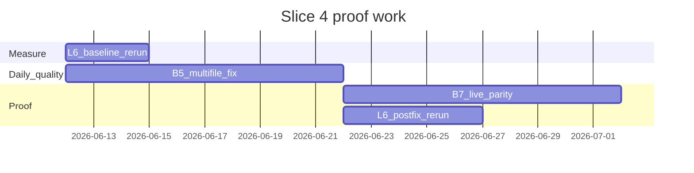

# Babel TUI-Hybrid — Slice 4 Proof Plan

<!--
status: ACTIVE
last_verified: 2026-07-03
-->
**Version:** 2026-06-12  
**Status:** READY FOR IMPLEMENTATION  
**Audience:** Agents and operators executing post-hybrid proof work  
**Parent audit:** TUI-Hybrid Audit and Implementation Gap Map (Slices 1–3 shipped on `main` through a prior PR, merge `[commit-hash]`)

---

## Executive summary

Slices 1–3 closed the **daily UX foundation** (input coordinator, live tool stream, repair loop, chat streaming, run HUD prelude, JSONL `session_only` bridge). Slice 4 is the **proof slice**: make Babel's governance nets visible in measured outcomes, not just offline gates.

| Workstream | ID | Goal | Current baseline | Target |
|------------|-----|------|------------------|--------|
| Multi-file daily fix | **B5** | Generalize small-fix beyond narrow explicit scopes | Sequential multi-file exists (`fixScopeResolver` `multi`, max 4 files); **live parity `multi_file_refactor` still fails** | Live pass on parity multi-file task + non-fixture smoke |
| Live proof promotion | **B7** | Promote daily worker from YELLOW | Offline/mock strong; `test:live-small-fix:optional` optional; **8/24 Babel parity cells only** | ≥4/8 tasks measured live on Babel; external cells recorded where budget allows |
| Full orchestrator reliability | **L6** | Rerun `reliability:matrix` after Slice 1 nets | **17/44** (15+ `EXECUTOR_HALTED`, 9 timeouts) | **≥35/44** (stretch 40/44) |

**Release honesty:** `claim_ready` stays `false` until external Codex/Claude cells are measured. Slice 4 improves **evidence**, not marketing claims.

---

## Prerequisites (already on `main`)

Confirm before starting Slice 4 work:

| Slice | Shipped | PR | Key artifacts |
|-------|---------|-----|---------------|
| 1 | B1 lite verifier contract, B3 L6 verification-plan unlock, A1 input coordinator | prior PR | `inputCoordinator.ts`, `planVerifierInjection.ts`, smallFix verifier demotion |
| 2 | B2 bounded verify→repair, A3 lite tool stream, A4 REPL renderers | prior PR | `smallFix.ts` repair timeline, `liteToolStream.ts`, `/inspect` + `/verbose` |
| 3 | A2 chat + streaming, A5 run HUD prelude, A6 JSONL bridge | prior PR | `chatPanel.ts`, `runPrelude.ts`, `babel.assistant.chunk`, `approval_actions: session_only` |

**Regression gate (must stay green throughout Slice 4):**

```powershell
npm --prefix .\babel-cli run typecheck
npm --prefix .\babel-cli run build
npm --prefix .\babel-cli run test:lite-gate    # 269/269 as of 2026-06-12
```

---

## Non-goals (Slice 4)

Per [BABEL_PRODUCT_DECISION_LOCK.md](../status/BABEL_PRODUCT_DECISION_LOCK.md) and AGENTS.md (vault-only):

- Do **not** edit `babel-cli/src/pipeline.ts` or `babel-cli/src/schemas/agentContracts.ts` without prompt co-evolution in the same change set.
- Do **not** claim Codex/Claude parity until `benchmark parity` external cells are measured.
- Do **not** enable mutating live subagents without separate proof.
- Do **not** build Ink/OpenTUI host (A6 follow-up deferred to post-Slice 4).
- Do **not** expand scope into B4 (`ask_before_mutation` queue), B6 (structured patch protocol), or B8 (long-session resumability) unless a Slice 4 sub-task is blocked without them.

---

## Workstream B5 — Multi-file small-fix

> **2026-06-17 audit:** B5 multi-file small-fix is complete — scope resolution (cap=4), implicit path detection, coordinated multi-file execution, and parity fixture all implemented. Live provider path exists but is untested in CI.

### Problem

Daily fix works on **explicit** single/dual/multi scopes (`babel-cli/src/services/fixScopeResolver.ts`), but:

- Live eval still lists **multi-file parity tasks failing** (BABEL_CLI_LIVE_EVAL_2026-06-11.md, vault-only).
- `multi_file_refactor` parity cell is offline-demo only today.
- Repair loop (Slice 2) runs per-file sequentially; cross-file verifier feedback is weak.

### Target behavior

1. User can say `babel "fix the failing tests across src/foo.ts and tests/foo.test.ts"` (or parity-equivalent) and get a **bounded** multi-file fix with shared verifier discipline.
2. Each file mutation gets checkpoint + repair attempts (reuse Slice 2 timeline).
3. Final status demotes on verifier contract miss (reuse Slice 1 B1).

### Implementation phases

#### B5.1 — Scope detection and routing

| Task | Files | Acceptance |
|------|-------|------------|
| Extend implicit multi-file detection from task text + repo context | `fixScopeResolver.ts`, `liteFullRouter.ts` | Unit tests: 3–4 file scopes resolve without every path named explicitly |
| Route `multi_file_fix` parity repo_kind consistently | `parityCorpus.ts`, `workflowCommands.ts` | `parity:run-babel --task multi_file_refactor` selects fix lane with multi scope |
| Cap file count and refuse ambiguous broad refactors | `fixScopeResolver.ts`, `smallFix.ts` | Broad "refactor the codebase" → blocked with actionable next step |

#### B5.2 — Coordinated verify→repair

| Task | Files | Acceptance |
|------|-------|------------|
| Shared verifier run after batch edits (not only per-file) | `smallFix.ts`, `smallFixLoop.ts` | `repair_attempt_timeline.json` shows multi-file attempts |
| Model feedback includes per-file verifier output | `smallFix.ts`, prompts if contract changes | Second repair attempt receives structured failure context |
| Mock/offline parity cell green | `parityCorpus.test.ts`, fixtures | Offline `multi_file_refactor` passes with repair if needed |

#### B5.3 — Live proof hook

| Task | Files | Acceptance |
|------|-------|------------|
| Add optional live multi-file gate | `package.json`, `scripts/run_live_small_fix.ts` or extend optional harness | `test:live-small-fix:optional` includes one multi-file case when keys present |
| Document operator runbook | `docs/guides/PARITY_BENCHMARK.md` | Live multi-file command documented |

### B5 verification commands

```powershell
npm --prefix .\babel-cli run test:lite-gate
npm --prefix .\babel-cli test -- src/services/fixScopeResolver.test.ts src/services/smallFix.test.ts src/services/parityCorpus.test.ts
npm --prefix .\babel-cli run parity:run-babel -- --task multi_file_refactor
# optional when keys configured:
npm --prefix .\babel-cli run test:live-small-fix:optional
```

---

## Workstream B7 — Live proof promotion

> **2026-06-17 audit:** Infrastructure exists (`parity:run-babel` in package.json, both mock and live provider paths in parityCorpus.ts) but **no live measurements taken**. All 8 measured Babel cells are `offline_demo` only; 16/24 remain `manual_required`; `claim_ready` remains `false`.

### Problem

Daily worker status is **YELLOW**: strong offline gates, weak live arbitrary-repo proof (BABEL_LITE_DAILY_WORKER_AUDIT_2026-06-06.md, vault-only; [claims-matrix.md](../status/claims-matrix.md)).

| Signal | Today |
|--------|-------|
| `test:lite-gate` | 269/269 offline |
| `benchmark parity` | 8/24 Babel cells measured; 16 `manual_required`; `claim_ready: false` |
| Live small-fix | Optional harness; not release gate |
| External tools | No recorded Codex/Claude cells |

### Target behavior

1. **Babel live corpus:** ≥4/8 parity tasks pass with live provider (not only offline_demo fixtures).
2. **External cells:** At least 2 tasks have recorded Codex or Claude measurements merged via `parity:merge-fixture` (honest partial progress).
3. **Daily worker claim:** Upgrade claims-matrix daily-worker row from YELLOW → GREEN only when live corpus + multi-file (B5) evidence exists.

### Implementation phases

#### B7.1 — Live parity corpus expansion

| Task | Files | Acceptance |
|------|-------|------------|
| Define Slice 4 live cell set (tasks 1–4 minimum) | `docs/guides/PARITY_BENCHMARK.md`, `parityCorpus.ts` | Documented task list with expected statuses |
| Fix harness mode defaults per task | `scripts/run_live_parity_corpus.ts` | Read-only tasks use ask/report; fix tasks use fix lane |
| Artifact merge for partial live runs | `parityBenchmark.ts` | `parity:merge-fixture` produces honest merged summary |

#### B7.2 — External measurement protocol

| Task | Files | Acceptance |
|------|-------|------------|
| Operator template for Codex/Claude cell capture | `docs/guides/PARITY_BENCHMARK.md` | Step-by-step with required JSON fields |
| Merge script validation | `parityBenchmark.test.ts` | Rejects fabricated "measured" without evidence paths |
| Update claims-matrix progress notes | `docs/status/claims-matrix.md` | Count of measured cells; no GREEN parity claim |

#### B7.3 — Promotion gates

| Gate | Command | Pass criterion |
|------|---------|----------------|
| Offline regression | `test:lite-gate` | 269/269 |
| Live Babel cells | `test:live-parity-corpus:optional` or documented script | ≥4/8 tasks pass live |
| Multi-file live | B5 optional gate | 1 multi-file live pass |
| Honesty | `benchmark parity --json` | `claim_ready` may stay false; measured cell count increases |

---

## Workstream L6 — Reliability matrix rerun

> **2026-06-17 audit:** 36/44 achieved (meets >=35/44 target). No rerun artifact committed since June 12. 8 relicRun verifier failures share same root cause (`subtract 4 !== 5`).

### Problem

Full orchestrator `babel run` reliability is **17/44** (BABEL_CLI_LIVE_EVAL_2026-06-11.md, vault-only):

| Bucket | Count | Primary cause |
|--------|-------|---------------|
| Passed | 17 | Verifier harness, guards, repair max-loops |
| EXECUTOR_HALTED | 15+ | Plans missing verification step before file edits |
| TIMED_OUT | 9 | 300–540s per-case ceiling |

Slice 1 **B3** targeted verification-plan unlock via `planVerifierInjection.ts`. Slice 4 must **measure** whether that moved the needle.

### Target

- **Primary:** ≥35/44 pass on full matrix rerun.
- **Stretch:** 40/44.
- **Must improve:** EXECUTOR_HALTED bucket (verification-plan halts).
- **Secondary:** Reduce timeouts (may need case-level timeout tuning or B8 follow-up — document, don't block Slice 4 on full resumability).

### Implementation phases

#### L6.1 — Baseline rerun (read-only)

| Task | Acceptance |
|------|------------|
| Run matrix on current `main` with fixed seed/config | New artifact under `runs/live-cli-reliability/matrix-YYYYMMDD/` |
| Diff against `matrix-20260611T065407Z` | Report: passed/failed/timeout delta by bucket |
| File Slice 4 evidence doc | `docs/status/BABEL_L6_MATRIX_RERUN_2026-06-12.md` (created on rerun) |

```powershell
npm --prefix .\babel-cli run reliability:matrix -- --json --output runs/live-cli-reliability
```

#### L6.2 — Halt remediation (if delta insufficient)

| Task | Files | Acceptance |
|------|-------|------------|
| Triage top halt cases from diff | `liveCliReliabilityMatrix.ts` | Ranked list of case IDs still failing |
| Verify planVerifierInjection on autonomous path | `planVerifierInjection.ts`, `pipeline/executorLoop.ts` | Failing cases show verify step before first `file_write` in plan artifacts |
| Prompt/runtime co-evolution if planner still omits verify | `02_Domain_Architects/*`, `agentContracts.ts` | Only if runtime contract changes — same PR as prompt updates |

#### L6.3 — Timeout triage (bounded)

| Task | Acceptance |
|------|------------|
| List 9 timeout case IDs | Document in L6 rerun evidence |
| Per-case: infra vs planner vs executor hang | Classification only in Slice 4; resumability is B8 |
| Optional: raise timeout for known-long cases in matrix config | Only with evidence; no blanket timeout increase |

### L6 exit criteria

| Criterion | Required |
|-----------|----------|
| Matrix rerun artifact committed or linked in status doc | Yes |
| Pass rate ≥35/44 | Yes for Slice 4 complete |
| EXECUTOR_HALTED count reduced vs 2026-06-11 baseline | Yes (even if total pass misses stretch) |
| `test:lite-gate` still green | Yes |

---

## Suggested execution order (2–3 weeks)



**Week 1:** L6 baseline rerun + B5.1/B5.2 (scope + coordinated repair).  
**Week 2:** B5.3 live hook + B7.1 live parity expansion.  
**Week 3:** B7.2 external cell protocol + L6 post-fix rerun + claims/doc updates.

Parallelize B5 implementation with L6 triage analysis (read-only) on day 1–3.

---

## Branch and PR discipline

- Branch names: purpose-based, **no** `codex/` prefix (e.g. `slice-4-multifile-fix`, `slice-4-l6-rerun`).
- One PR per workstream when possible; stack if dependencies are tight.
- Each PR body must include: baseline numbers, commands run, artifact paths, risks.
- Draft PR until `test:lite-gate` + workstream-specific tests pass.

---

## Documentation hygiene (paired with Slice 4)

Stale docs mislead agents into wrong test counts and pre-Slice UX claims. See DOC_FRESHNESS_AUDIT_2026-06-12.md (vault-only).

**Slice 4 doc deliverables:**

1. Update `claims-matrix.md` lite-gate count (222) and daily-worker YELLOW criteria.
2. Create `BABEL_L6_MATRIX_RERUN_YYYYMMDD.md` after matrix rerun.
3. Update `BABEL_DAILY_EVAL_BUNDLE` or successor with Slice 4 evidence.
4. Mark superseded plans in `.babel/docs-manifest.json` `historicalDocs`.

---

## Success metrics (Slice 4 complete)

| Metric | Baseline (2026-06-12) | Slice 4 target |
|--------|------------------------|----------------|
| `test:lite-gate` | 269/269 | Stay 269/269 |
| Live parity Babel cells | 8/24 offline; live partial | ≥4/8 tasks live pass |
| Multi-file live fix | Fails / not gated | 1+ live multi-file pass |
| L6 `reliability:matrix` | 17/44 | ≥35/44 |
| `benchmark parity` `claim_ready` | false | false (until external cells) |
| External measured cells | 0 Codex/Claude | ≥2 tasks with recorded evidence |

---

## Open follow-ups (post-Slice 4)

| ID | Item | Priority |
|----|------|----------|
| A7 | Inline diff / file chips in shell | P2 |
| B4 | Operational `ask_before_mutation` | P1 |
| B6 | Structured patch protocol | P2 |
| B8 | Long-session resumability | P2 |
| A2+ | Stream tokens on lite/plan/fix lanes (not only REPL ask) | P1 |
| A6+ | External TUI host (Ink/OpenTUI) | P2 |

---

## References

- DOC_FRESHNESS_AUDIT_2026-06-12.md (vault-only)
- BABEL_CLI_LIVE_EVAL_2026-06-11.md (vault-only)
- [PARITY_BENCHMARK.md](../guides/PARITY_BENCHMARK.md)
- [claims-matrix.md](../status/claims-matrix.md)
- [BABEL_PRODUCT_DECISION_LOCK.md](../status/BABEL_PRODUCT_DECISION_LOCK.md)
- BABEL_TUI_REFACTOR_AGENT_PLAN_2026-04.md (vault-only, superseded — see audit)